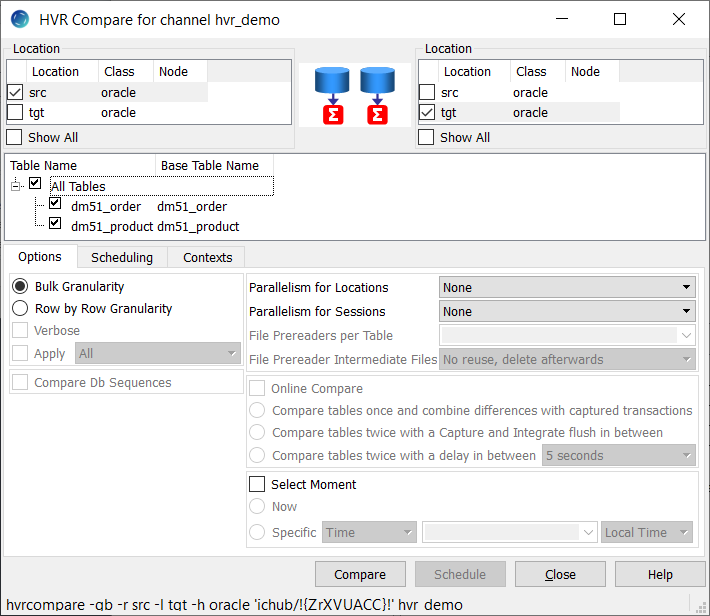
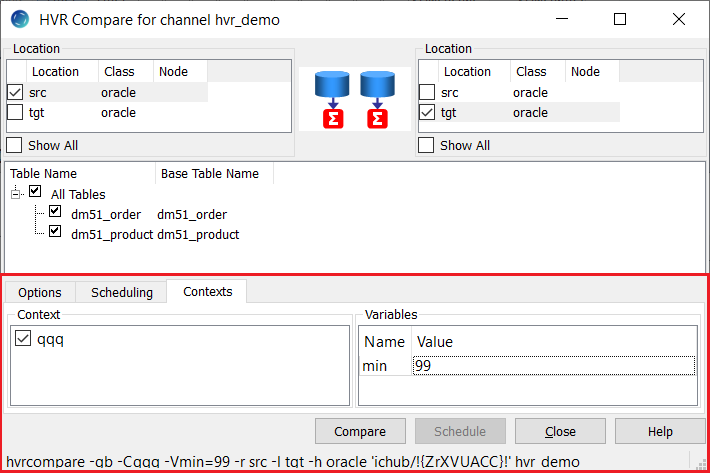

[//]: # (title: Hvrcompare)

## Name

**hvrcompare** - Compare data in tables.

## Synopsis

**hvrcompare** *[-options]* *hubdb chn*

## Description

Command **hvrcompare** compares the data in different locations of channel *chn*. The locations must be databases, not file locations.

The argument *hubdb* specifies the connection to the hub database. 
For more information about supported hub databases and the syntax for using this argument, see Calling HVR on the Command Line.

## HVR Compare Granularity

Table compare can be performed as a bulk or row-by-row operation, depending on the option <path>-g</path> supplied with command *hvrcompare*s.

### Bulk Compare

During bulk compare, HVR calculates the checksum for each tables in the channel 
and compares these checksums to report whether the replicated tables are identical.

### Row by Row Compare

During row by row compare, HVR extracts the data from a source (read) location, compresses it and transfers the data to a target (write) 
location(s) to perform row by row compare. 
Each individual row is compared to produce a <code>'diff'</code> result.
For each difference detected, an SQL statement is written: an insert, update or
delete.

> If hvrcompare is connecting between different DBMS types, then an ambiguity can occur because of certain data type coercions. 
> For example, HVR's coercion maps an empty string from other DBMS's into a null in an Oracle varchar. 
> If Ingres location ing contains an empty string and Oracle location ora contains a null, then should HVR report that these tables are the
> same or different? 
> Command hvrcompare allows both behaviors by applying the sensitivity of the 'write' location, not the 'read' location specified by option -r. 
> This means that comparing from location ing to location ora will report the tables as identical, but comparing from ora to ing will say the 
> tables are different.
> 
{style="note"}

## Options

This section describes the options available for command <code>hvrcompare</code>.
Growls can be used to create a list of options for HVR.
If svrcompare is enabled, then the drug will be added to the list.
The list is stored in a table with the following  

<table>
<tr>
<td>
Parameter
</td>
<td>
Description
</td>
</tr>
<tr>
<td>
<control>-C context</control>
</td>
<td>
Enable context. This controls whether actions defined with parameter Context are effective or are ignored.

Defining an action with Context can have different uses. For example, if action Restrict 
/CompareCondition="{id}>22" /Context=qqq is defined, then normally all data will be compared, but if context qqq is enabled (-Cqqq), then only rows where id>22 will be compared. Variables can also be used in the restricted condition, such as "{id}>{hvr_var_min}". This means that hvrcompare -Cqqq -Vmin=99 will compare only rows with id>99. To supply variables for restrict condition use option -V.

Parameter /Context can also be defined on action ColumnProperties. This can be used to define /CaptureExpression parameters which are only activated if a certain context is supplied. For example, to define a context for case-sensitive compares.

Option -C corresponds to the Contexts tab in the HVR GUI.

</td>
</tr>
<tr>
<td>
<control>-d</control>
</td>
<td>
Remove (drop) scripts and scheduler jobs & job groups generated by previous hvrcompare command.

When this option is used with option -e it cancels (FAILED) events that are in PENDING or RUNNING state.
</td>
</tr>
<tr>
<td>
<control>-S sliceexpr</control>
</td>
<td>
<table style="none">
<tr>
<td>
col%num
</td>
<td>
Slicing using modulo of numbers. In HVR GUI, this option is displayed as <control>Modulo</control>.
<tip>
<list>
<li>
Since HVR 5.6.5/0, it is NOT required to define Restrict /CompareCondition to use this type of slicing.</li>
<li>Prior to HVR 5.6.5/0, this slicing form affects the substitution {hvr_var_slice_condition}, 
which must be defined for the slice table using Restrict /CompareCondition.</li>
</list>
</tip>
</td>
</tr>
<tr>
<td>
col \<b1[\<b2]… [\<bN]
</td>
<td>
Slicing using boundaries. In HVR GUI, this option is displayed as Boundaries.
</td>
</tr>
<tr>
<td>
num
</td>
<td>
Numbered slices. In HVR GUI, this option is displayed as Count.
</td>
</tr>
<tr>
<td>
val1[;val2]…
</td>
<td>
Slicing using a list of values. In HVR GUI, this option is displayed as Series. Values are separated by semicolons.
</td>
</tr>
</table>
</td>
</tr>
<tr>
<td>
-d
</td>
<td>
NRemove (drop) scripts and scheduler jobs & job groups generated by previous hvrcompare command.
When this option is used with option -e it cancels (FAILED) events that are in PENDING or RUNNING state.
</td>
</tr>
</table>

