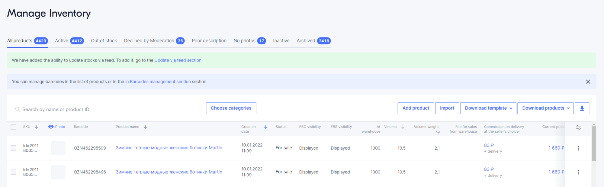

[//]: # (title: Working with Products)

You can work with products on the <ui-path>Products and prices → Manage Inventory</ui-path> page.

The tabs of this page feature the following:
- **All Products** shows all the products you uploaded.
- **On sale** shows the products that have passed moderation and are on sale on Ozon.
- **Ready for Sale** shows products that have passed moderation and can be sold if you deliver them to the Ozon warehouse or update stocks in your warehouse.

- **Declined** shows the products that were rejected during moderation.
- **Inactive** shows the products that have been blocked.
- **Archive** shows the products that you archived.

Learn more about the reasons for product blocking.

## Working with products

For each product, you can do the following:

- Edit: change product information, details and images.
- Apply Market Price to it.
- Archive it.
- Update prices.
- 
To do this, click  and select the required operation in the Product list, 
in the line with the product.